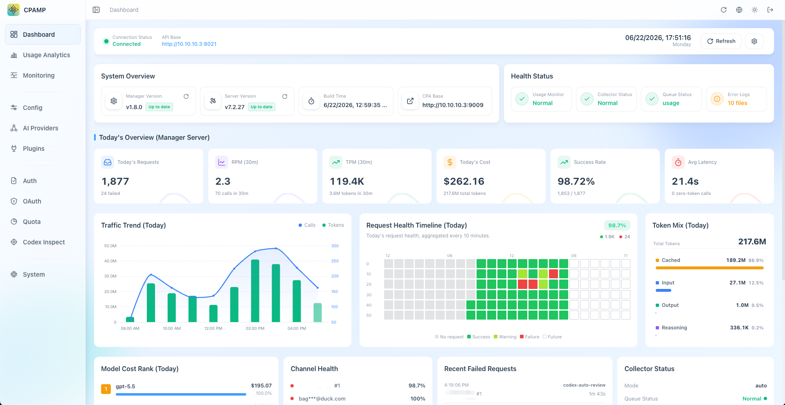
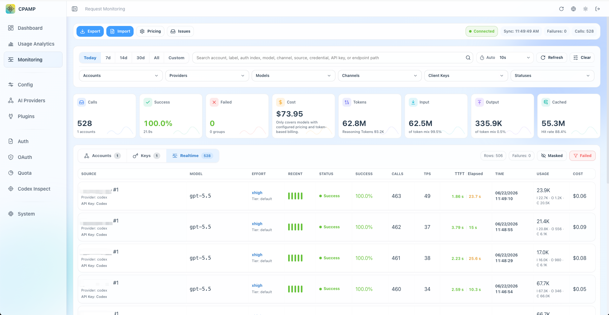
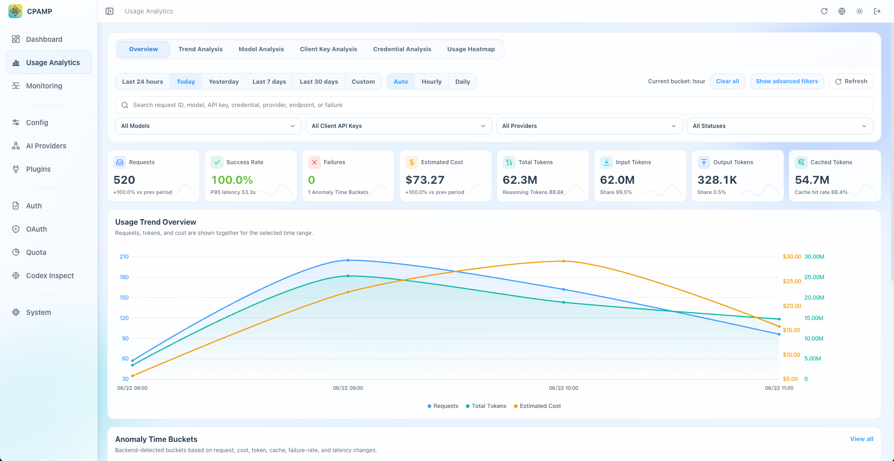
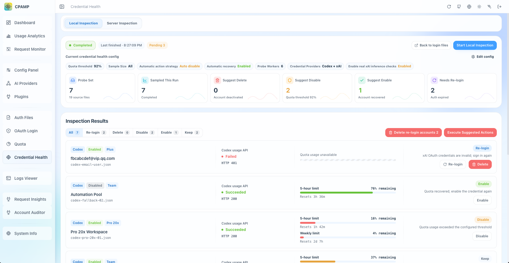

<div align="center">

# CPA Manager Plus

[](https://github.com/seakee/CPA-Manager-Plus/releases/latest)
[](https://github.com/seakee/CPA-Manager-Plus/blob/main/LICENSE)
[](https://hub.docker.com/r/seakee/cpa-manager-plus)
[](https://github.com/seakee/CPA-Manager-Plus/stargazers)

A self-hosted CPA / CLIProxyAPI management panel and AI gateway observability dashboard for requests, usage, cost, quota, failures, and account health.

Operate providers, credentials, OAuth, plugins, and configuration while keeping persistent request history, cost analytics, and account automation in local storage.

[中文](README_CN.md) ｜ [Live Demo](https://seakee.github.io/CPA-Manager-Plus/) ｜ [Documentation](https://seakee.github.io/CPA-Manager-Plus/docs/en/) ｜ [Install](#quick-start)

</div>

## What Can CPAMP Help You Answer?

- **Why are requests failing?** Inspect failure rates, status codes, affected models/accounts, and redacted evidence in persistent request history.
- **Where is the cost going?** Break down tokens and estimated cost by model, provider, account, API key, project, channel, and time range.
- **Are accounts and quotas healthy?** Review credential state, quota windows, reset evidence, and controlled automation for Codex and xAI accounts.

## Screenshots

<table>
  <tr>
    <td align="center">
      <strong>Dashboard</strong><br>
      
    </td>
    <td align="center">
      <strong>Request Monitoring</strong><br>
      
    </td>
  </tr>
  <tr>
    <td align="center">
      <strong>Usage Analytics</strong><br>
      
    </td>
    <td align="center">
      <strong>Account Health</strong><br>
      
    </td>
  </tr>
</table>

## Which Panel Should You Choose?

CPA / CLIProxyAPI can serve either the official Management Center or the CPAMP Lightweight Panel directly on `:8317`. The lightweight panel replaces the official UI without adding another service. Deploy CPAMP Full Mode when you also need persistent observability and long-running operations.

| Option                                                                                                       | Best for                                                    | Entry                                   |
| ------------------------------------------------------------------------------------------------------------ | ----------------------------------------------------------- | --------------------------------------- |
| Official [CLI Proxy API Management Center](https://github.com/router-for-me/Cli-Proxy-API-Management-Center) | Keeping the upstream UI maintained by the CPA project       | CPA `:8317/management.html`             |
| CPAMP Lightweight Panel                                                                                      | Replacing only the UI without another service or database   | CPA `:8317/management.html`             |
| CPAMP Full Mode                                                                                              | Request history, cost analytics, inspection, and automation | Manager Server `:18317/management.html` |

See [Choosing A CPA Panel](https://seakee.github.io/CPA-Manager-Plus/docs/en/guide/choosing-a-panel.html) for the comparison, or [install the CPAMP Lightweight Panel](https://seakee.github.io/CPA-Manager-Plus/docs/en/deployment/cpa-panel.html) directly in CPA.

## Core Capabilities

### CPA Gateway Management

- Manage CPA provider configurations, including Gemini, Codex, Claude, Vertex, xAI, and OpenAI-compatible providers.
- Maintain auth files, OAuth logins, API keys, model aliases, priorities, plugins, logs, and system settings.
- Import official Sub2API OpenAI OAuth exports and split multiple accounts into separate CPA Codex auth files.

### Request Monitoring And Failure Diagnosis

- Persist requests from the CPA usage queue in local SQLite and search account, client API key, and realtime request views.
- Inspect status, latency, token, cache, trace, and redacted failure evidence without exposing raw failure bodies.
- Export or import request history as JSONL.
- Open the [Monitoring Demo](https://seakee.github.io/CPA-Manager-Plus/#/demo/monitoring).

### Cost And Usage Analytics

- Break down calls, tokens, cost, latency, and failures by model, provider, account, credential, API key, project, channel, and time range.
- Track input, output, reasoning, cache, service tier, and long-context pricing semantics.
- Sync model prices from models.dev first, with LiteLLM and OpenRouter fallbacks plus local overrides for aliases or internal models.
- Open the [Usage Analytics Demo](https://seakee.github.io/CPA-Manager-Plus/#/demo/usage-analytics).

### Account Health, Quota, And Automation

- Inspect Codex and xAI accounts locally or on a Manager Server schedule.
- Read quota windows, reset evidence, credential state, workspace state, and provider-specific health signals when available.
- Apply controlled quota cooldowns and route credential failures into an account action queue for review and recovery.
- Open the [Account Inspection Demo](https://seakee.github.io/CPA-Manager-Plus/#/demo/codex-inspection) and [Auth Files Demo](https://seakee.github.io/CPA-Manager-Plus/#/demo/auth-files).

### Production Operations

- Run CPAMP Full Mode as one Docker container or a native Linux, macOS, or Windows package for amd64/arm64; the full stack can run alongside CPA.
- Keep request history, Manager configuration, automation state, and model prices in local files with no account registration or telemetry SDK.
- Back up SQLite files together with `data.key` to preserve encrypted CPA Management Keys.

Want to preview the interface first? Open the [Live Demo](https://seakee.github.io/CPA-Manager-Plus/). The demo uses fictional data only. It is not a deployment or runtime mode and cannot connect to, manage, or monitor a real CPA instance.

CPAMP manages and observes traffic through CPA / CLIProxyAPI. It is not a replacement proxy and does not forward model traffic by itself.

## Quick Start

### Installer

For a guided full-stack or CPAMP-only deployment:

```bash
curl -fsSLO https://raw.githubusercontent.com/seakee/CPA-Manager-Plus/main/bin/install-cpamp.sh
bash install-cpamp.sh
```

Preview without deploying:

```bash
CPAMP_DRY_RUN=1 bash install-cpamp.sh
```

See [One-Click Installer](https://seakee.github.io/CPA-Manager-Plus/docs/en/deployment/installer.html) for upgrade, repair, and admin-key recovery behavior.

### CPA + CPAMP Together

```yaml
services:
  cli-proxy-api:
    image: eceasy/cli-proxy-api:latest
    restart: unless-stopped
    ports:
      - '8317:8317'
    volumes:
      - cpa-data:/app/data

  cpa-manager-plus:
    image: seakee/cpa-manager-plus:latest
    restart: unless-stopped
    ports:
      - '18317:18317'
    volumes:
      - cpa-manager-plus-data:/data

volumes:
  cpa-data:
  cpa-manager-plus-data:
```

```bash
docker compose up -d
```

Open `http://<host>:18317/management.html`, retrieve the CPAMP Admin Key from the Manager Server log, then enter the CPA URL and CPA Management Key during setup.

### CPAMP Only

If CPA is already running:

```bash
docker run -d \
  --name cpa-manager-plus \
  --restart unless-stopped \
  -p 18317:18317 \
  -v cpa-manager-plus-data:/data \
  seakee/cpa-manager-plus:latest
```

Recommended CPA version: `v7.1.39+`. The HTTP usage queue needs `v6.10.8+`.

## Documentation

| Task                                                      | Guide                                                                                                                                                                                                |
| --------------------------------------------------------- | ---------------------------------------------------------------------------------------------------------------------------------------------------------------------------------------------------- |
| Choose the right panel and deployment mode                | [Choosing A CPA Panel](https://seakee.github.io/CPA-Manager-Plus/docs/en/guide/choosing-a-panel.html)                                                                                                |
| Replace the official UI without deploying another service | [CPAMP Lightweight Panel](https://seakee.github.io/CPA-Manager-Plus/docs/en/deployment/cpa-panel.html)                                                                                               |
| Install and complete first setup                          | [Getting Started](https://seakee.github.io/CPA-Manager-Plus/docs/en/guide/getting-started.html)                                                                                                      |
| Understand supported features and modes                   | [Capability Matrix](https://seakee.github.io/CPA-Manager-Plus/docs/en/reference/capability-matrix.html)                                                                                              |
| Understand runtime ports, keys, and request flow          | [Runtime Model](https://seakee.github.io/CPA-Manager-Plus/docs/en/guide/runtime-model.html)                                                                                                          |
| Configure providers, credentials, quota, and plugins      | [Panel Manual](https://seakee.github.io/CPA-Manager-Plus/docs/en/manual/ai-providers.html)                                                                                                           |
| Operate Manager Server, backups, upgrades, and migrations | [Manager Server Guide](https://seakee.github.io/CPA-Manager-Plus/docs/en/operations/manager-server.html)                                                                                             |
| Back up data or recover a lost admin key                  | [Backup And Restore](https://seakee.github.io/CPA-Manager-Plus/docs/en/operations/backup.html), [Reset Admin Key](https://seakee.github.io/CPA-Manager-Plus/docs/en/operations/reset-admin-key.html) |
| Migrate and cut over between SQLite and MySQL             | [Database Backends](docs/database-backends.md)                                                                                                                                                       |
| Migrate from the legacy CPA-Manager                       | [Migration From CPA-Manager](https://seakee.github.io/CPA-Manager-Plus/docs/en/migration/from-cpa-manager.html)                                                                                      |
| Diagnose empty monitoring or queue problems               | [Troubleshooting](https://seakee.github.io/CPA-Manager-Plus/docs/en/troubleshooting/request-monitoring.html)                                                                                         |

## Data, Privacy, And Security

- CPAMP does not phone home, include analytics SDKs, or require account registration.
- External calls are limited to the CPA gateway and integrations you explicitly configure or trigger, such as OAuth, provider checks, plugin releases, and model price sync.
- Request history, configuration, model prices, inspection history, and automation state stay in the SQLite or MySQL backend you select.
- CPA Management Keys are encrypted before persistence; database backups must be kept with `data.key`.
- Normal APIs and JSONL exports expose redacted failure summaries, never raw failure bodies or stored raw JSON.
- CPAMP is intended for traffic and credentials you are authorized to operate.

## Development

```bash
npm install
npm run dev
npm run type-check
npm run lint
npm run test
npm run build
npm run docs:build
```

Manager Server:

```bash
cd apps/manager-server
go test ./...
go test -race ./...
go vet ./...
go run ./cmd/cpa-manager-plus
```

Build the Docker stack locally:

```bash
docker compose -f docker-compose.manager.yml up --build
```

## Release

- `npm run build` creates a single-file `apps/web/dist/index.html`.
- `bin/release/package-native.sh` embeds the panel into native packages.
- Create release notes through `release/<version> -> dev -> main`, then push a
  strict `vX.Y.Z` or prerelease tag from the verified `main` promotion merge.
- `npm run release:validate -- --tag <tag> --content-only` checks the three
  required release files before a tag is created.
- `.github/workflows/release.yml` offers a `workflow_dispatch` dry-run from
  `main`; it validates and builds without publishing a GitHub Release,
  container image, or Telegram message.
- Release assets include `management.html`, native packages, and Docker images for `linux/amd64` and `linux/arm64`.
- Release publishing is serialized and has no automatic commit-log fallback;
  missing or mismatched notes fail closed. See [`docs/release.md`](docs/release.md)
  for recovery and required repository protections.

## Acknowledgements

- Thanks to [CLIProxyAPI](https://github.com/router-for-me/CLIProxyAPI) and the official [CLI Proxy API Management Center](https://github.com/router-for-me/Cli-Proxy-API-Management-Center) for the runtime and WebUI foundation.
- Thanks to the [Linux.do](https://linux.do/) community for project promotion and feedback.

## License

[MIT](https://github.com/seakee/CPA-Manager-Plus/blob/main/LICENSE) — Copyright 2026 Seakee.
